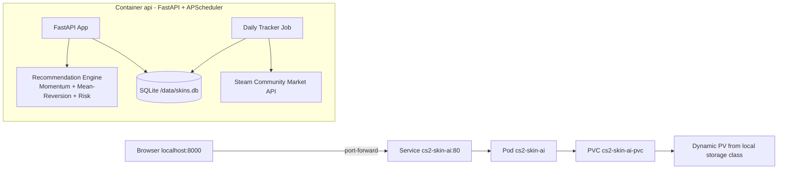

# CS2 Skin AI Intelligence - Architecture (Local Kubernetes)

## Runtime Footprint (Current Manifests)
When you deploy `k8s/*.yaml` as-is, Kubernetes creates:

- `1 x Deployment`: `cs2-skin-ai`
- `1 x Pod` (from Deployment, `replicas: 1`)
- `1 x Service (ClusterIP)`: `cs2-skin-ai` (`80 -> 8000`)
- `1 x ConfigMap`: `cs2-skin-ai-config`
- `1 x PVC`: `cs2-skin-ai-pvc` (`1Gi`, `ReadWriteOnce`)

No Ingress is created by default. Access is typically via:

- `kubectl port-forward svc/cs2-skin-ai 8000:80`

## High-Level Architecture



## Request and Data Flow

1. User opens dashboard/API endpoint.
2. Service routes traffic to the FastAPI pod.
3. FastAPI reads snapshots from SQLite (`/data/skins.db`).
4. Recommendation engine calculates top picks.
5. Scheduled tracker (every 24h) fetches Steam prices and writes snapshots.

## Persistence Behavior

### With PVC (current default)
- Data survives pod restart/reschedule.
- Suitable for demo continuity and historical charts.

### Without PVC
- App still runs, but data is ephemeral.
- History is lost when pod is recreated.
- Useful for quick stateless demos.

## Optional No-PV Deployment
Use `k8s/deployment-no-pv.yaml` instead of `k8s/deployment.yaml`.

Option A (`.sh`):
```bash
bash scripts/deploy_local_k8s.sh no-pv
kubectl port-forward svc/cs2-skin-ai 8000:80
```

Option B (`kubectl apply`):
```bash
kubectl apply -f k8s/configmap.yaml
kubectl apply -f k8s/deployment-no-pv.yaml
kubectl apply -f k8s/service.yaml
kubectl rollout status deployment/cs2-skin-ai
kubectl port-forward svc/cs2-skin-ai 8000:80
```

## PVC Deployment (Persistent)

Option A (`.sh`):
```bash
bash scripts/deploy_local_k8s.sh
kubectl port-forward svc/cs2-skin-ai 8000:80
```

Option B (`kubectl apply`):
```bash
kubectl apply -f k8s/pvc.yaml
kubectl apply -f k8s/configmap.yaml
kubectl apply -f k8s/deployment.yaml
kubectl apply -f k8s/service.yaml
kubectl rollout status deployment/cs2-skin-ai
kubectl port-forward svc/cs2-skin-ai 8000:80
```

## One Script, Two Modes

```bash
# Persistent mode (default, PVC-backed)
bash scripts/deploy_local_k8s.sh

# Ephemeral mode (no PVC)
bash scripts/deploy_local_k8s.sh no-pv
```

## Verification Commands

```bash
kubectl get deploy,pod,svc,cm,pvc
kubectl describe deploy cs2-skin-ai
kubectl logs deploy/cs2-skin-ai --tail=200
```

## Slide-Friendly Summary

- Single-service architecture (FastAPI monolith) in one pod.
- Internal scheduler performs market ingestion.
- SQLite for persistence, mounted at `/data`.
- ClusterIP service + local port-forward for access.
- Easily switched between persistent (PVC) and ephemeral (no-PV) modes.
